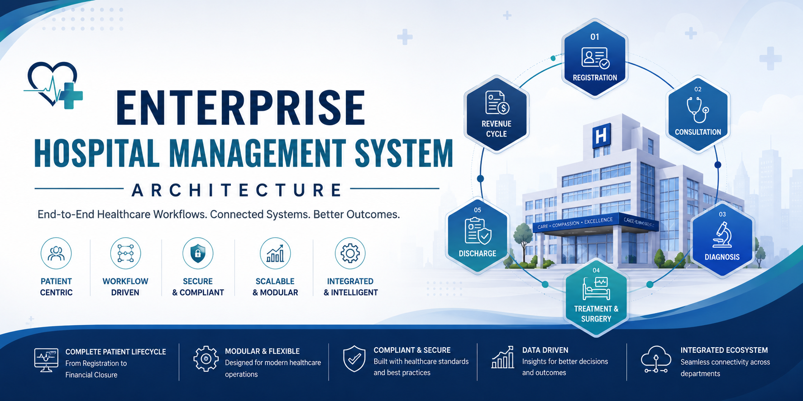

<p align="center">
  
</p>

# Enterprise Hospital Management System (HMS) Architecture

<p align="center">

**A comprehensive reference architecture for an Enterprise Hospital Management System (HMS), demonstrating end-to-end healthcare workflows, clinical processes, operational workflows, and revenue cycle management.**

Designed to showcase **system design thinking**, **workflow modeling**, and **enterprise application architecture** for modern healthcare platforms.

---


</p>

---

# Overview

Modern hospitals are among the most workflow-intensive organizations, requiring seamless coordination across multiple departments, clinical teams, administrative staff, laboratories, pharmacies, billing systems, and insurance providers.

This repository presents a **reference architecture** for a Hospital Management System that models the complete patient journey—from registration through consultation, diagnosis, treatment, surgery (when applicable), billing, insurance processing, and financial closure.

Rather than focusing on implementation details, this project emphasizes **business workflows**, **system architecture**, **decision-driven processes**, and **enterprise software design principles** commonly found in healthcare platforms.

---

# Project Objectives

This architecture has been designed to demonstrate:

- End-to-End Patient Journey Modeling
- Enterprise Healthcare Workflow Design
- Modular Clinical Process Architecture
- Business Rule–Driven Decision Flows
- Revenue Cycle Management
- Insurance-Aware Healthcare Processes
- Scalable Enterprise System Design
- Reusable Workflow Components
- Patient-Centric Digital Transformation

---

# Complete Patient Journey

The architecture models the complete lifecycle of a patient inside a hospital.

```text
Patient Registration
        │
        ▼
Appointment Scheduling
        │
        ▼
Consultation
        │
        ▼
Admission (If Required)
        │
        ▼
Clinical Assessment
        │
        ▼
Diagnosis
        │
        ▼
Treatment Planning
        │
        ▼
Medical / Surgical Treatment
        │
        ▼
Discharge
        │
        ▼
Billing
        │
        ▼
Insurance Processing
        │
        ▼
Revenue Cycle Management
        │
        ▼
Encounter Closure
```

---

# Workflow Phases

| Phase | Module | Description |
|--------|--------|-------------|
| Phase 1 | Patient Registration | Register patient demographics, identifiers, and visit information |
| Phase 2 | Appointment & Consultation | Appointment booking, OPD consultation, and clinical assessment |
| Phase 3 | Admission & Diagnosis | IPD admission, investigations, diagnosis, and care planning |
| Phase 4 | Clinical Decision | Treatment planning based on medical evaluation |
| Phase 5 | Treatment & Surgery | Medical treatment, surgical workflows, recovery, and discharge |
| Phase 6 | Revenue Cycle | Billing, insurance claims, payments, and financial closure |

---

# Technology Architecture Overview

The following diagram illustrates how the business workflow maps to the technology stack used to build an enterprise-grade Hospital Management System.

<p align="center">
  
</p>

---

# Key Features

### Patient Management

- Patient Registration
- Appointment Scheduling
- Patient Search
- Visit Management
- Admission & Discharge

---

### Clinical Workflow

- OPD Workflow
- IPD Workflow
- Doctor Consultation
- Nursing Workflow
- Clinical Documentation
- EMR Integration

---

### Diagnostic Services

- Laboratory
- Radiology
- Investigation Orders
- Diagnostic Reports

---

### Pharmacy

- Prescription Management
- Drug Dispensing
- Inventory Validation

---

### Surgery Management

- Surgical Planning
- Insurance Validation
- OT Scheduling
- Consent Management
- Post-Operative Recovery

---

### Revenue Cycle

- Billing
- Insurance Processing
- Claim Settlement
- Patient Payments
- Financial Closure

---

# Technology Concepts Demonstrated

Although this repository is architecture-focused, it showcases concepts commonly used in enterprise healthcare platforms.

## Architecture

- Modular Architecture
- Workflow-Driven Design
- Business Process Modeling
- Decision Trees
- Layered Architecture
- Domain-Driven Thinking

## Enterprise Concepts

- Role-Based Access Control (RBAC)
- Dynamic Forms
- Workflow Engine
- Business Rules Engine
- Clinical Documentation
- Audit Trails
- Revenue Cycle Management

## Software Engineering

- Reusable Components
- Scalable Design
- Separation of Concerns
- High Cohesion
- Low Coupling
- Configurable Workflows

---

# Repository Structure

```text
Hospital-Management-System-Architecture
│
├── README.md
│
├── diagrams/
│   ├── Complete-HMS-Workflow.png
│   ├── Patient-Journey.png
│   ├── OPD-Workflow.png
│   ├── Diagnosis-Workflow.png
│   ├── Treatment-Workflow.png
│   └── Revenue-Cycle.png
│
├── docs/
│   ├── Patient-Journey.md
│   ├── OPD.md
│   ├── IPD.md
│   ├── Diagnosis.md
│   ├── Treatment.md
│   └── Revenue-Cycle.md
│
├── architecture/
│
├── database/
│
├── api/
│
└── screenshots/
```

---

# Architecture Highlights

This reference architecture demonstrates:

- Complete Patient Lifecycle Management
- Modular Workflow Design
- Enterprise Business Process Modeling
- Clinical Decision-Based Workflows
- Insurance-Aware Treatment Flow
- Revenue Cycle Integration
- End-to-End Digital Patient Journey
- Financial & Clinical Process Integration

---

# Future Roadmap

The repository will continue to evolve with additional architectural assets, including:

- High-Level System Architecture
- Component Diagrams
- Deployment Architecture
- Database ER Diagrams
- REST API Documentation
- Sequence Diagrams
- Role-Based Access Matrix
- Workflow State Diagrams
- Healthcare Integration Concepts (FHIR / HL7)
- AI-Assisted Clinical Decision Support
- Analytics & Reporting Architecture

---

# Purpose

This repository serves as an architecture portfolio to demonstrate enterprise system design, workflow modeling, and healthcare domain knowledge. It is intended for learning, discussion, and showcasing software architecture concepts rather than representing a production implementation.

---

# Feedback

Architecture evolves through collaboration. Suggestions, improvements, and discussions on workflow design, scalability, and healthcare systems are always welcome.

If you have ideas or feedback, feel free to open an issue or start a discussion.

---

## If you found this project interesting, consider giving it a star!
